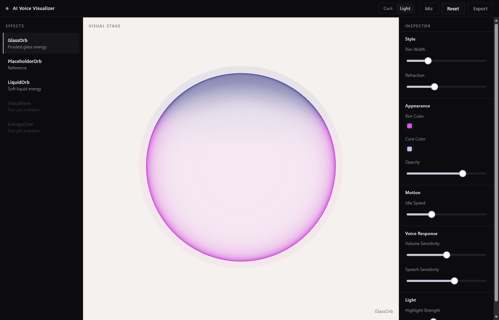
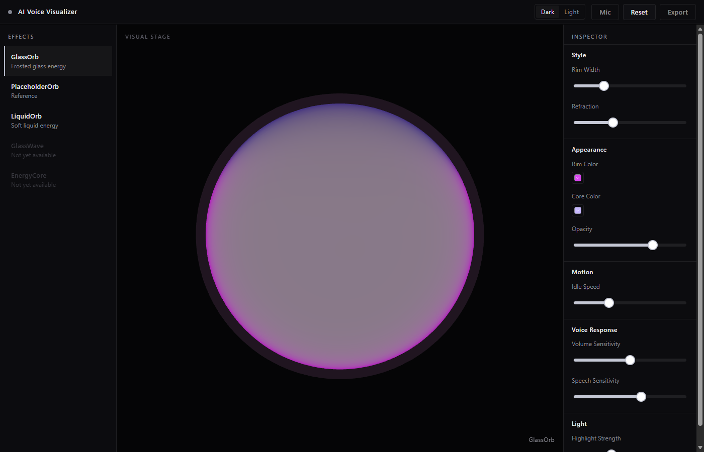
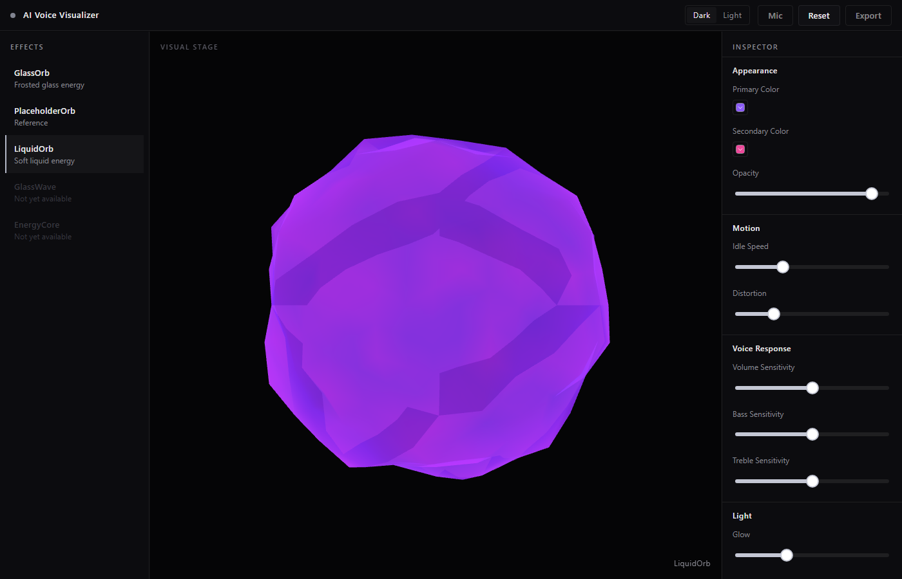

# TASK-006 Report

Status: COMPLETED

## Summary

落地独立产品效果 GlassOrb（白核、洋红 rim、顶部靛蓝新月），并把 Stage 背景切成 dark/light；默认加载为 GlassOrb + light stage。后续按用户参考图把默认观感从棱面冰晶改成正圆软边玻璃球。

## Changed

- `src/visual/types.ts`：`ControlGroup` 增加 `style`；`StageStyle`；`EffectDefinition.preferredStageStyle`；`VisualEngineOptions.onEffectSelected`
- `src/visual/VisualEngine.ts`：`setEffect` 成功后调用 `onEffectSelected(definition)`（不引入 Pinia）
- `src/visual/index.ts`：导出 GlassOrb / `StageStyle`
- `src/visual/effects/LiquidOrb.ts` / `PlaceholderOrb.ts`：`preferredStageStyle: 'dark'`
- `src/types/editor.ts`：`EffectId` + `EFFECT_OPTIONS` 增加 `glass-orb`
- `src/stores/editor.ts`：去掉 hardcoded `'placeholder-orb'`；`selectedEffectId` 初始 `null`；`stageStyle` / `userOverrideStageStyle`；`setStageStyle`（手动覆盖）/ `applyPreferredStageStyle`（仅在未覆盖时）
- `src/components/editor/VisualStage.vue`：GlassOrb 最先注册；`data-stage-bg`；light 舞台文字对比度；先挂 watch 再 `syncAvailableEffects`；截图用 `?effect=` / `?stage=`
- `src/components/editor/EditorHeader.vue`：Dark / Light 切换（文件是 Header，不是 spec 写的 `AppHeader.vue`）
- `src/components/inspector/InspectorPanel.vue`：`GROUP_ORDER` 增加 `style`，顺序 style → appearance → motion → voiceResponse → light
- `src/styles/tokens.less`：`--color-bg-stage-dark` / `--color-bg-stage-light` / light 舞台文字 token
- `scripts/verify-editor-wiring.ts`：覆盖 unset 默认值与 stage override

## Added

- `src/visual/effects/GlassOrb.ts`
- `src/visual/shaders/glassOrb.ts`
- `scripts/verify-glass-orb.ts`

## Removed

- None

## 1. What was implemented（对照 spec §4 / §5）

| Spec | 落地 | 差异 |
|---|---|---|
| GlassOrb 独立 Effect，9 控件，5 组 | `GlassOrb.ts` keys：rimColor / coreColor / opacity / rimWidth / refractionIntensity / idleSpeed / volumeSensitivity / speechSensitivity / highlightStrength | 无 |
| Shader uniforms + fresnel / 高光带 / 折射近似 | `glassOrb.ts`：白核 + 底部洋红 + 顶部靛蓝新月 + 外侧软光晕 mesh | 几何用 `SphereGeometry(1,96,96)` 替代 `IcosahedronGeometry(1,5)`，避免棱面；折射仍为颜色叠加 |
| 注册顺序 GlassOrb → LiquidOrb → PlaceholderOrb | `VisualStage.vue` | 无 |
| 清掉 store hardcoded `placeholder-orb` | 初始 `null`，由 `syncAvailableEffects(defaultId)` 填入 | 无 |
| `preferredStageStyle` | GlassOrb `light`；Liquid/Placeholder `dark` | 无 |
| `setEffect` 触发舞台切换 | Engine 回调 `onEffectSelected` → store `applyPreferredStageStyle` | **未**在 `src/visual` 里 import Pinia。若直接调 `setStageStyle` 会把 override 锁死。手动 Header 走 `setStageStyle`（override=true） |
| Header Dark/Light | `EditorHeader.vue` 分段按钮，无 emoji | spec 写 `AppHeader.vue` / 🌙☀️；实际文件是 EditorHeader |
| Inspector 五分区 | `GROUP_ORDER` 含 style | spec §5.2 未列 Inspector，但 §6.1.2 要求可见 |
| 截图 query | `?stage=dark`、`?effect=liquid-orb` | 仅验收 harness，不持久化 |

## 2. Default-page observations（§6.1.1 / §6.2.1）

默认 URL `http://localhost:18805/`：

- Effects 选中 GlassOrb
- Header Light 为 on
- Stage 近白底，球体居中：近白核心、底部洋红 rim、顶部靛蓝弧
- Inspector 五组 9 控件

## 3. Stage 切换行为（§6.1.3–6.1.5 / §6.2.2）

- Header Dark/Light 调用 `setStageStyle`，写入 `userOverrideStageStyle=true`
- 未手动覆盖时，切 Effect 跟随 `preferredStageStyle`（LiquidOrb / PlaceholderOrb → dark）
- 手动覆盖后，切 Effect 不再改舞台
- `?stage=dark` 等价于用户切 Dark（用于 headless）

light 舞台下 `VISUAL STAGE` / `GlassOrb` 走 `--color-text-stage-light-muted`，仍然可读。

## 4. Regression check（§6.2.3）

与 `.cursor/reports/TASK-005-fix.png` 对比：球体仍居中，紫粉主色范围一致。TASK-005-fix 当时 headless ShaderMaterial 几乎全黑；本次 LiquidOrb 球体可见，回归捕获更完整。Inspector 仍是 Appearance / Motion / Voice Response / Light 四组（无 Style）。Header 新增 Dark/Light，不影响 LiquidOrb 控件。

## 5. Architecture compliance（§6.3）

- ✅ `from 'three'` 仅 `src/visual/**`（`scripts/verify-*.ts` 除外）
- ✅ `requestAnimationFrame` 仅 `VisualEngine.ts`
- ✅ AudioData 不进 Pinia
- ✅ GlassOrb 不使用 LiquidOrb 的 `primaryColor` / `secondaryColor` / `distortion` / `bassSensitivity` / `trebleSensitivity` / `glowIntensity`。共享的 `opacity` / `idleSpeed` / `volumeSensitivity` 是通用键，spec 允许

## 6. Open issues

- Headless SwiftShader 下 ShaderMaterial 偶发全黑；Dark GlassOrb 截图若全黑请重拍。
- 默认观感已按参考图 1 重做（正圆、白核、洋红底、靛蓝顶）。仍无后处理 bloom，外圈光晕是第二层 mesh 近似。
- 麦克风未接；安静时内部流动很弱。
- `stageStyle` 不写 localStorage（spec Out of Scope）。
- 几何从 spec 的 Icosahedron(1,5) 改为 SphereGeometry，为了正圆轮廓。

## Tested

- `npx tsx scripts/verify-glass-orb.ts`：GlassOrb self-check passed
- `npx tsx scripts/verify-liquid-orb.ts`：LiquidOrb self-check passed
- `npx tsx scripts/verify-editor-wiring.ts`：Editor wiring self-check passed
- `npm run build`：vue-tsc + Vite production build 通过
- Headless Edge：`msedge.exe --headless --use-angle=swiftshader --enable-unsafe-swiftshader --screenshot=... --virtual-time-budget=5000|8000 --window-size=1400,900`
  - `http://localhost:18805/` → `TASK-006-light.png`
  - `http://localhost:18805/?stage=dark` → `TASK-006-dark-orb.png`
  - `http://localhost:18805/?effect=liquid-orb` → `TASK-006-dark-liquid.png`

## Issues

- 见 §6 Open issues

## Next

等待 WorkBuddy Review。对 WorkBuddy 说：`Review TASK-006`
